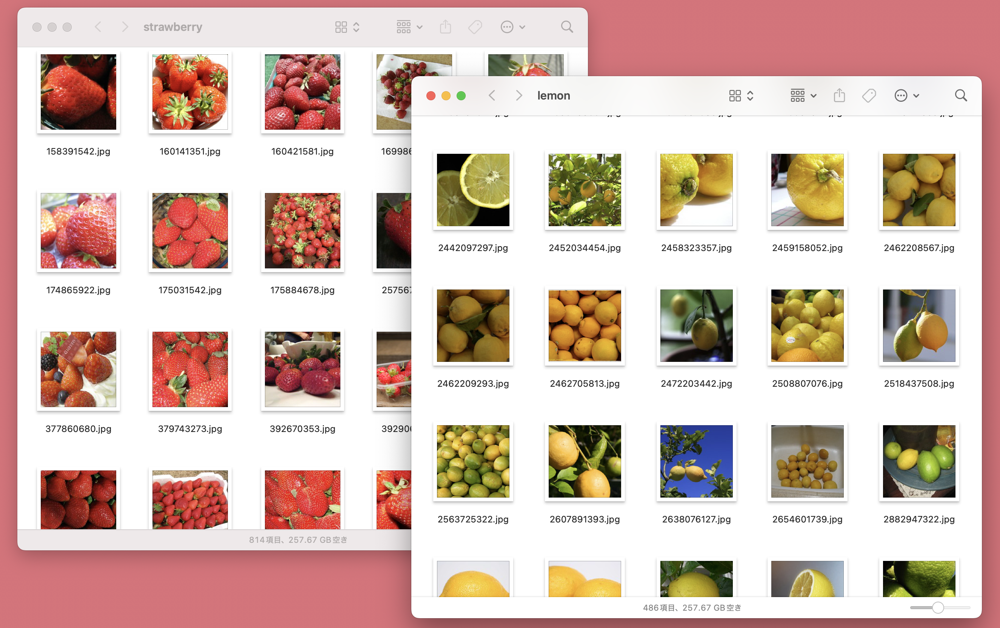

# フルーツ画像のデータセット

著作権的問題のない大量の果物の画像をダウンロードして、分類したものです。
Creative Commons 営利利用可のものだけをダウンロードしました。

ソースは、Flickrで、「lemon」「strawberry」でダウンロードして分類を行いました。

ここでは、dataディレクトリ以下に、ラーメンの種類ごとに分類しています。

- イチゴ: strawberry (407枚)
- レモン: lemon (243枚)

## 画像情報

- 画像トータル枚数: 650枚
- 画像サイズ (150x150)
- 機械学習用途のために制作

-------------------

# Fruit Image Dataset

This is a collection of a large number of fruit images downloaded and classified without copyright issues.
Only images under Creative Commons licenses permitting commercial use were downloaded.

The sources were Flickr, where images were downloaded and classified using the keywords “lemon” and “strawberry.”

Here, the images are categorized under the `data` directory by fruit type.

- Strawberry: 407 images
- Lemon: 243 images

## Image Information

- Total number of images: 650
- Image size: 150x150
- Created for machine learning purposes

